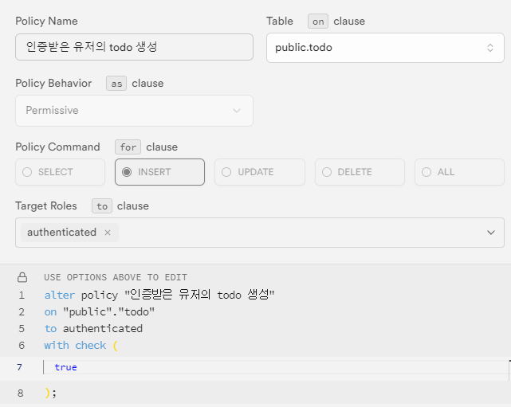
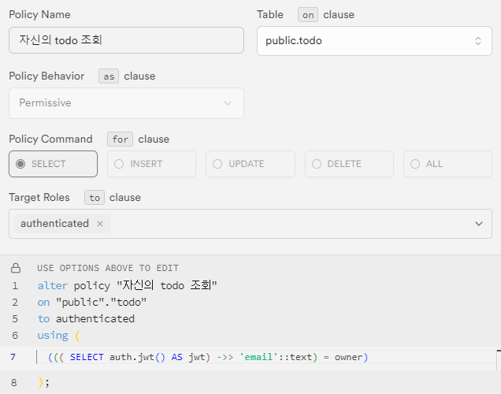
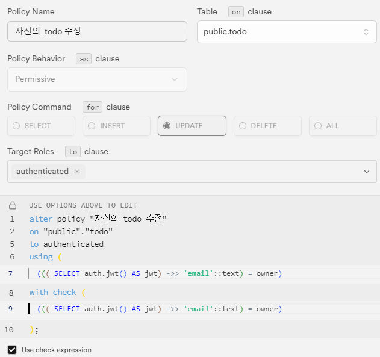
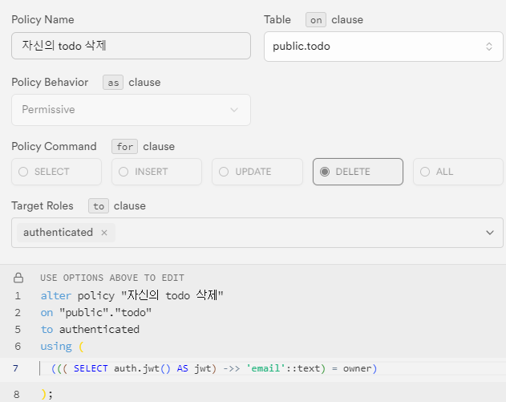

# Supabase 설정

- .env 생성
  ```
  NEXT_PUBLIC_SUPABASE_URL={Project Dashboard -> Project URL}
  NEXT_PUBLIC_SUPABASE_ANON_KEY={Project Dashboard -> API Key}
  NEXT_SUPABASE_SERVICE_ROLE={Supabase API Settings -> service_role}
  NEXT_SUPABASE_DB_PASSWORD={Supabase DB PASSWORD}
  ```
- supabase login
  ```
  npx supabase login
  ```
- package.json에 명령어 추가
  ```
  "scripts": {
    "generate-types": "npx supabase gen types typescript --project-id ycpvavtxirbegbcmugdd --schema public > types_db.ts"
  }
  ```
- supabase database schema에 대한 type 생성
  ```
  npm run generate-types
  ```
- `types_db.ts` 파일 확인
- RLS 설정
  - INSERT 설정
    - 
  - SELECT 설정
    - 
  - UPDATE 설정
    - 
  - DELETE 설정
    - 
